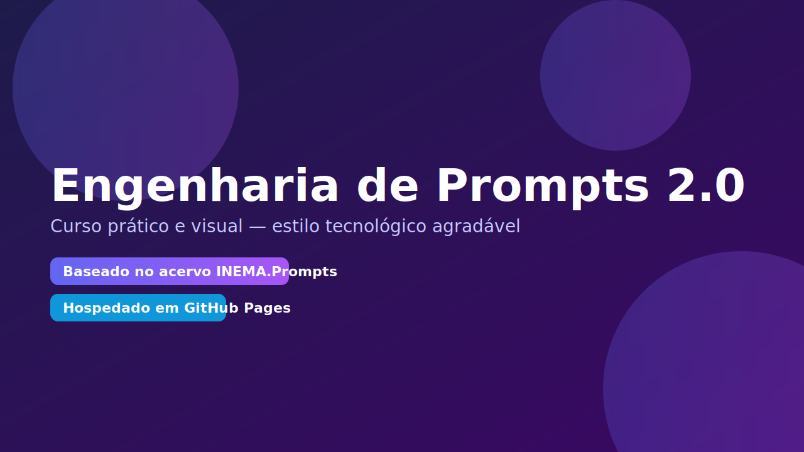

# Engenharia de Prompts 2.0<link rel="stylesheet" href="styles/theme.css"><section class="hero">    
    <a href="modulo1_fundamentos/README.md" class="md-button md-button--primary">Começar agora</a>    <a href="#modulos-e-progresso" class="md-button">Ver módulos</a>  
</section>> Curso prático e visual, com base no acervo “INEMA.Prompts”. Estilo tecnológico e agradável. Hospedado em GitHub Pages. Atividades via GitHub Discussions.[Começar agora](modulo1_fundamentos/README.md){ .md-button .md-button--primary }## O que você vai aprender- Estruturar prompts claros e reutilizáveis- Padrões e melhores práticas (otimização, segurança, consistência)- Casos de uso: conteúdo, design, automação e mais- Assistentes, memória e RAG na prática- Projetos finais aplicados ao seu contexto## Módulos e Progresso {#modulos-e-progresso}- [ ] Módulo 1 — Fundamentos- [ ] Módulo 2 — Padrões e Melhores Práticas- [ ] Módulo 3 — Casos de Uso- [ ] Módulo 4 — Assistentes, Memória e RAG- [ ] Módulo 5 — Automação e Ferramentas- [ ] Módulo 6 — Projetos Finais> Dica: use o botão “Editar esta página” (no topo) para sugerir melhorias via PR.## Acervo e inventário- Inventário de tópicos: [docs/data/inventory.json](data/inventory.json)- Pasta de dados: [docs/data/2494987106](data/2494987106)## Como acessar o conteúdo1. Abra o repositório no GitHub e navegue pelos módulos (pastas `docs/…`).2. Cada módulo tem: vídeo curto, resumo prático, exercício e desafio extra.3. Atividades e dúvidas: use o **GitHub Discussions** do repositório.## Comunidade- Dúvidas e exercícios: https://github.com/inematds/prompts/discussions- Issues e sugestões: https://github.com/inematds/prompts/issues---### Créditos- Base de conteúdo: `Docs/2494987106.zip` (dump do grupo “INEMA.Prompts”).- Tema: MkDocs Material.
# Engenharia de Prompts 2.0

<link rel="stylesheet" href="styles/theme.css">

<section class="hero">
  
  

    <a href="modulo1_fundamentos/README.md" class="md-button md-button--primary">Começar agora</a>
    <a href="#modulos-e-progresso" class="md-button">Ver módulos</a>
  

</section>

## O que você vai aprender
- Estruturar prompts claros e reutilizáveis
- Padrões e melhores práticas (otimização, segurança, consistência)
- Casos de uso: conteúdo, design, automação e mais
- Assistentes, memória e RAG na prática
- Projetos finais aplicados ao seu contexto

## Módulos e Progresso {#modulos-e-progresso}
- [ ] Módulo 1 — Fundamentos {#m1}
- [ ] Módulo 2 — Padrões e Melhores Práticas {#m2}
- [ ] Módulo 3 — Casos de Uso {#m3}
- [ ] Módulo 4 — Assistentes, Memória e RAG {#m4}
- [ ] Módulo 5 — Automação e Ferramentas {#m5}
- [ ] Módulo 6 — Projetos Finais {#m6}

> Dica: use o botão “Editar esta página” (no topo) para sugerir melhorias via PR.

  

    <h3>Fundamentos</h3>
    
Bases sólidas e estrutura reutilizável.

    <a class="md-button md-button--primary" href="modulo1_fundamentos/README.md">Abrir módulo 1</a>
  

  

    <h3>Padrões</h3>
    
Templates técnicos e otimização.

    <a class="md-button md-button--primary" href="modulo2_padroes/README.md">Abrir módulo 2</a>
  

  

    <h3>Casos de Uso</h3>
    
Aplicação prática e variações.

    <a class="md-button md-button--primary" href="modulo3_casos_uso/README.md">Abrir módulo 3</a>
  

  

    <h3>Assistentes & RAG</h3>
    
Persona, memória e recuperação.

    <a class="md-button md-button--primary" href="modulo4_assistentes_memoria/README.md">Abrir módulo 4</a>
  

  

    <h3>Automação</h3>
    
Conectar prompts a fluxos.

    <a class="md-button md-button--primary" href="modulo5_automacao_ferramentas/README.md">Abrir módulo 5</a>
  

  

    <h3>Projetos</h3>
    
Entrega final com evidências.

    <a class="md-button md-button--primary" href="modulo6_projetos_finais/README.md">Abrir módulo 6</a>
  

## Acervo e inventário
- Explore os tópicos e anexos do acervo: [Acervo](acervo.md)
- Inventário JSON (arquivos leves): [docs/data/inventory.json](data/inventory.json)

## Como estudar
- Comece por Fundamentos e siga os módulos em ordem.
- Em cada módulo: leia a aula rápida, aplique o resumo prático, faça o exercício e, se puder, o desafio.
- Publique suas entregas no Discussions com o template do módulo.
- Revise seus prompts com base nas evidências (antes/depois) e registre melhorias.

## Comunidade
- Dúvidas e exercícios: https://github.com/inematds/prompts/discussions
- Issues e sugestões: https://github.com/inematds/prompts/issues
