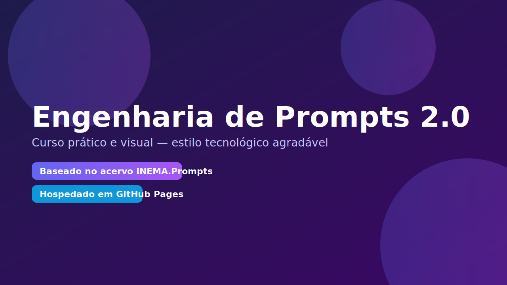

# Engenharia de Prompts 2.0

<section class="hero">
  
  

    <a href="modulo1_fundamentos/README.md" class="md-button md-button--primary">Começar agora</a>
    <a href="educacao/index.md" class="md-button">Trilhas de Educação</a>
    <a href="#modulos-e-progresso" class="md-button">Ver módulos</a>
  

  
</section>

> Curso prático e visual, com base no acervo INEMA.Prompts. Hospedado em GitHub Pages. Atividades via GitHub Discussions.

[Começar agora](modulo1_fundamentos/README.md){ .md-button .md-button--primary }
[Ver Trilhas de Educação](educacao/index.md){ .md-button }

## O que você vai aprender
- Estruturar prompts claros e reutilizáveis
- Padrões e melhores práticas (otimização, segurança, consistência)
- Casos de uso: conteúdo, design, automação e mais
- Assistentes, memória e RAG na prática
- Projetos finais aplicados ao seu contexto

## Trilhas de Educação
- Fundamentos → [Trilha](educacao/trilhas/fundamentos.md)
- Técnicas → [Trilha](educacao/trilhas/tecnicas.md)
- Avançado (Masterclass) → [Trilha](educacao/trilhas/avancado-masterclass.md)

## Módulos e Progresso {#modulos-e-progresso}
- [ ] Módulo 1 — Fundamentos
- [ ] Módulo 2 — Padrões e Melhores Práticas
- [ ] Módulo 3 — Casos de Uso
- [ ] Módulo 4 — Assistentes, Memória e RAG
- [ ] Módulo 5 — Automação e Ferramentas
- [ ] Módulo 6 — Projetos Finais

> Dica: use o botão “Editar esta página” (no topo) para sugerir melhorias via PR.

## Acervo e inventário
- Inventário de tópicos: [docs/data/inventory.json](data/inventory.json)
- Pasta de dados: [docs/data/2494987106](data/2494987106)

## Como acessar o conteúdo
1. Abra o repositório no GitHub e navegue pelos módulos (pastas `docs/...`).
2. Cada módulo tem: vídeo curto, resumo prático, exercício e desafio extra.
3. Atividades e dúvidas: use o **GitHub Discussions** do repositório.

## Comunidade
- Dúvidas e exercícios: https://github.com/inematds/Prompts/discussions
- Issues e sugestões: https://github.com/inematds/Prompts/issues

---

### Créditos
- Base de conteúdo: `Docs/2494987106.zip` (dump do grupo INEMA.Prompts) — mantido como referência histórica.
- Tema: MkDocs Material.

